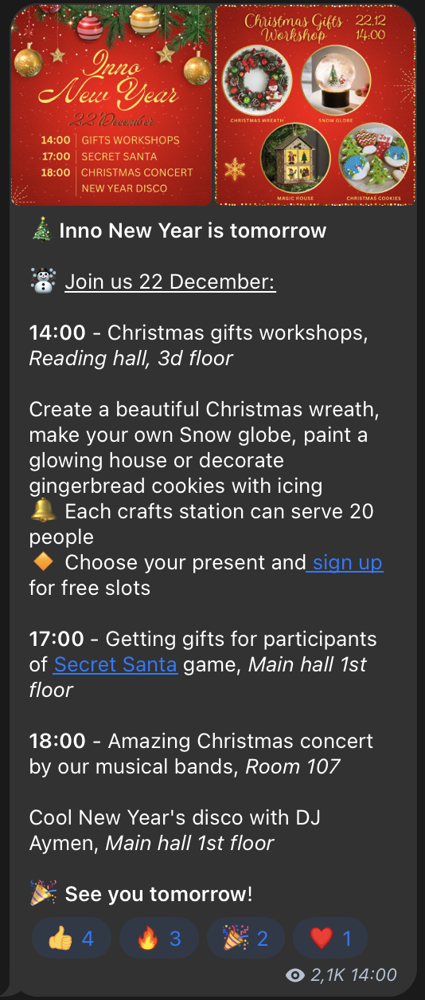
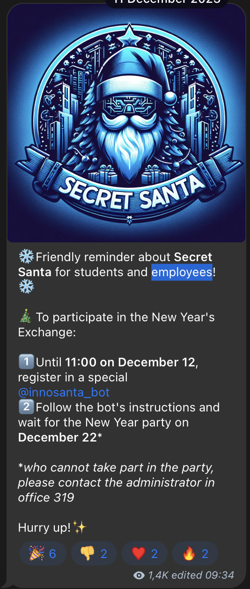
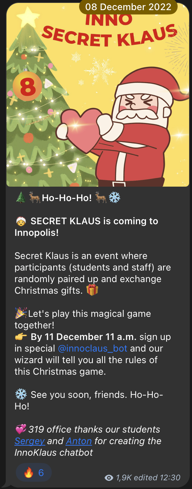

# sclaus

  

&ensp;[<kbd>   Overview   </kbd>](#overview)&ensp;
&ensp;[<kbd>   Development   </kbd>](#development)&ensp;
&ensp;[<kbd>   Deployment   </kbd>](#deployment)&ensp;
&ensp;[<kbd>   History   </kbd>](#histoty)&ensp;
  

## Overview
`sclaus` is a [telegram](https://web.telegram.org) bot for a tradition called "Secret Santa" (read more about Secret Santa on [wikipedia](https://en.wikipedia.org/wiki/Secret_Santa) and learn how to play Secret Santa on [elfster](https://www.elfster.com/content/secret-santa-rules)) hold at Innopolis University every year.

Name `sclaus` comes from [Santa Claus](https://en.wikipedia.org/wiki/Santa_Claus) shorted to SClaus.
Also it is sounds phonetically close to Scala language, in which is project is written.

## Development
WIP

## Deployment
WIP

## History
For the past three years (since 2022), [@dartt0n](https://t.me/dartt0n) (yes, it's me) create Secret Santa Bot for Innopolis University each time in a new language and with new functionalle. The very first bot was written in Python, the second one in Golang and this year I've decided to do it in Scala.

## License
`sclaus` is free and open-source under [MIT License](https://choosealicense.com/licenses/mit/).

Please, refer to [LICENSE]("./LICENSE") for details.
